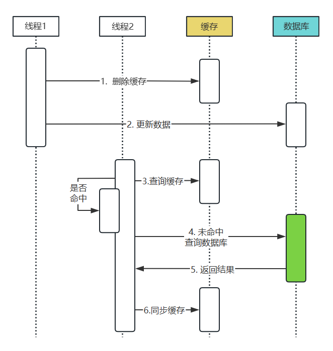
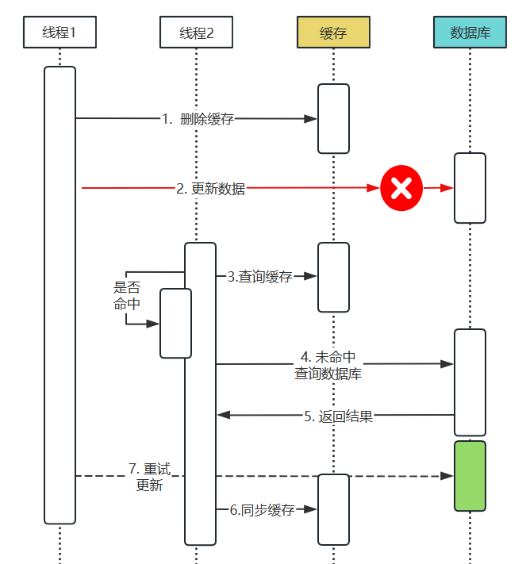

# 一致性的级别

在项目使用缓存的时候就需要考虑缓存的一致性问题

而一致性在其功能的特征上可以划分三个级别

> - 强一致性：在任何时间点，系统中的所有节点都能够看到相同的数据。这意味着在写入缓存后，必须立即将数据同步到数据库中。优点是数据一致性高，缺点是写入操作的性能较低。适用于对数据一致性要求非常高的场景，如金融交易系统。
>
> - > 金融交易：在金融交易中，数据的一致性是至关重要的，因此需要使用强一致性来保证交易的正确性
> - > 在线支付：在线支付需要保证数据的一致性和正确性，因此需要使用强一致性来保证支付的正确性

> - 弱一致性：在写入缓存后，系统中的不同节点可能会在不同的时间点看到不同的数据。这是因为缓存数据的同步操作可能会有一定的延迟。优点是写入操作的性能较高，缺点是数据一致性较低。适用于对数据一致性要求不是非常高的场景，如社交网络。
>
> - > 社交媒体平台：社交媒体平台需要处理大量的用户数据和内容，数据的一致性要求不高，而且需要快速地响应用户的操作，因此可以使用弱一致性来提高系统的性能和可扩展性
> - > 新闻网站评论系统：新闻网站的评论系统需要处理大量的用户评论，数据的一致性要求不高，而且需要快速地展示和更新评论，因此可以使用弱一致性来提高系统的性能和用户体验

> - 最终一致性：在写入缓存后，系统中的不同节点最终会达到一致的状态。这意味着缓存数据的同步操作可能会有一定的延迟，但最终会将数据同步到数据库中。优点是写入操作的性能较高，缺点是数据一致性较低。适用于对数据一致性要求较低，但对性能要求较高的场景，如内容分发网络（CDN）。
>
> - > 多节点数据库复制：多节点数据库复制需要保证数据的一致性和可靠性，数据的一致性要求不高，而且需要快速地进行数据同步和复制，因此可以使用最终一致性来提高系统的性能和可用性
> - > 日志分析系统：日志分析系统需要处理大量的数据，而且数据一致性要求不高，因此可以使用最终一致性来提高系统的性能

## 弱一致性

需注意：弱一致性（Weak Consistency）是指在写入缓存后，系统中的不同节点可能会在不同的时间点看到不同的数据。这是因为缓存数据的同步操作可能会有一定的延迟。

弱一致性强调的是在同步操作之前，不同节点可能会看到不同的数据，而不保证最终的一致性。

针对同步的策略可以分为四种情况：

- 先更新缓存，再更新数据库
- 先更新数据库，再更新缓存
- 先删除缓存，再更新数据库
- 先更新数据库，再删除缓存

针对弱一致性，实际主要关注的是本质是缓存的更新或删除问题。

> 更新缓存

- 优点：如果每次数据变化都能被及时更新，那么查询数据时不容易出现不命中的情况，
- 缺点：
    - 如果数据的计算复杂，频繁的更新会造成服务器性能的消耗比较大
    - 如果数据并不是被频繁使用，那么频繁更新也只是浪费服务器性能，对业务没有多大的帮助
- 适用于数据使用较为频繁，且数据的计算不那么复杂的场景

> 删除缓存

- 优点：不需要顾忌数据的复杂性，直接删除即可
- 缺点：查询数据时，增大未命中的几率，从而增大数据库的访问压力
- 适用于数据使用频率不高的场景

在业界中运用较多的方式以删除为主

### 先删除缓存，再更新数据库

如上两个线程，在正常的流程中

1. 线程1删除缓存后，再更新缓存
2. 线程2是先查询缓存，如果存在则直接返回不存在走数据库，再同步缓存

但在该方案中存在两个问题

> 如果线程1更新数据库失败的情况

1. 线程1删除缓存后，再更新缓存，但是更新失败了。
2. 线程2在此时去获取缓存中的数据，但是未命中
3. 因此线程2就会去读取数据库中的数据，因线程1更新失败，顾线程2当前读取的是旧数据
4. 线程2此时将数据库的数据同步到缓存中
5. 线程1 这个通过重试更新了新数据到数据库中。

> 如果在更新数据库时没有出现失败，线程1更新延迟也同样存在会造成数据不一致的情况

### 延迟双删

针对上面先删除缓存，再更新数据库的情况，同样还有另一种解决方案，就是程序在更新完数据后再删一次缓存。

操作步骤
1. 先删除缓存
2. 更新数据库
3. 线程等待 N秒（等待时间根据具体业务来判断）
4. 再删除缓存

> 存在问题

1. 线程需要在更新数据库后，还要休眠M秒再次淘汰缓存，等所有操作都执行完，这一个更新操作才真正完成，降低了更新操作的吞吐量

    解决办法：用“异步淘汰”的策略，将休眠M秒以及二次淘汰放在另一个线程中，A线程在更新完数据库后，可以直接返回成功而不用等待。

2. 如果第二次缓存淘汰失败，则不一致依旧会存在

    解决办法：用“重试机制”，即当二次淘汰失败后，报错并继续重试，直到执行成功

### 先更新后删除

操作过程

1. 线程1更新数据，在数据更新成功后删除缓存。
2. 而线程2读取数据依据缓存命中情况判断获取数据及写入缓存

这种方案在使用的时候需要考虑更新失败的问题，因为当删除缓存中的数据失败后就会造成线程2获取到缓存中的旧数据，从而会导致数据的不一致情况，如果没有删除失败因为延迟删除也可能导致不一致的问题。

极限情况：

- A线程进行读操作，缓存中没有相应的数据，将从数据库中读数据到缓存，此时分为两种情况，还未读取数据库的数据，已读取数据库的数据，不过由于网络等问题数据还未传输到缓存
- B线程执行写操作，更新数据库，淘汰缓存
- B线程写操作完成后，A线程才将数据库的数据读入缓存，对于第一种情况，A线程读取的是B线程修改后的新数据，没有问题，对于第二种情况，A线程读取的是旧数据，此时数据会不一致

## 最终一致性

从本质上来分析它是属于弱一致性的范畴。

### 队列方式

操作流程：

1. 线程A和线程B均不会直接去更新缓存
2. 线程A在更新完数据后发送信息至于队列中
3. 线程B查询缓存如果存在就返回，此时可能缓存还未更新
4. 线程B查询缓存如果不存在则从数据库中获取
5. mq队列根据请求信息更新缓存

优点：保障最终一致性
缺点：缓存不一致的时间不确定，可能会较长
场景：适合缓存信息影响不是很大的情况，如商城中的推荐商品

扩展

如果在前面的“先更新数据库，再删除缓存”的操作中如果存在更新失败的问题；

1. 可以让删除操作进入重试
2. 将更新失败的记录写入mq队列中，由队列重试处理

### 日志监听

实现：基于MySQL主从复制的方案，监听MySQL中binlog日志同步更新缓存。与发送mq队列更新类似，优点在于耦合低无代码入侵。

## 强一致性

### 串行化

1. 当存在数据需要修改时，数据项处于修改状态
2. 如果有新的请求进来则先至于mq队列中（设置任务超时）
3. 当数据修改成功后则解锁缓存数据项，而其他与之相关操作的数据则可以继续请求`
4. 如果载其中请求时间过长未执行则抛出异常，提升用户稍后再尝试

### 分布式锁

- 写请求

先获取锁，再删除缓存并更新数据库，最后释放锁。

- 读请求

读到缓存数据直接返回；读不到缓存数据，先尝试获取锁

- 获取锁失败，说明存在并发写操作，读数据库并返回数据
- 获取锁成功，说明不存在并发写操作，先读数据库再设置缓存,最后释放锁

如果标识过期但数据库还没更新完,那么锁需要支持自动续期(可参考redisson的实现)

### 基于开关控制

在操作上可以增加开关

- 写请求

- 读请求

- 恢复机制-异步

